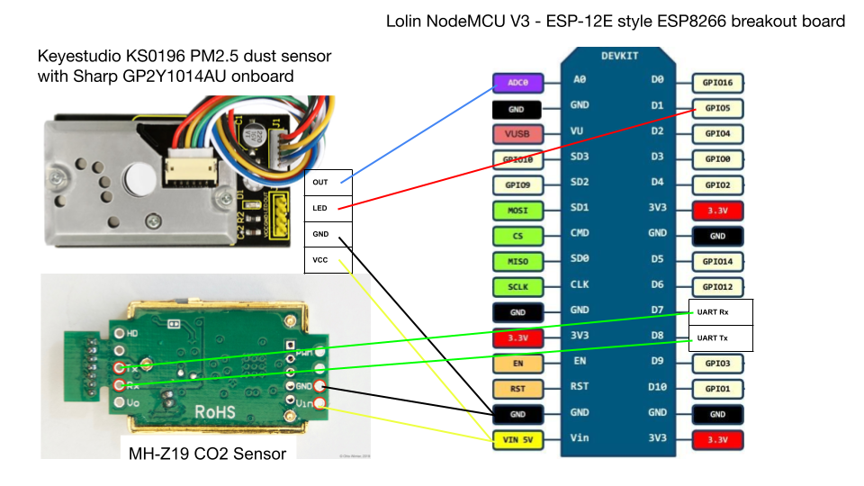

# esphome KS0196

Simple code for ESP-based custom dust sensor using Sharp GP2Y1010AU0F sensor in the Keyestudio KS0196 PM2.5 Dust Sensor Module.

Software used:

- ESPHome <https://esphome.io/>

Hardware used:

- Lolin NodeMCU V3, an ESP-12E style ESP8266 breakout board - <https://aliexpress.com/item/32665100123.html>
- Keyestudio KS0196 PM2.5 Dust Sensor Module, which includes a Sharp GP2Y1010AU0F sensor - <https://wiki.keyestudio.com/Ks0196_keyestudio_PM2.5_Dust_Sensor_Module>

Wiring:

Thanks to other examples of similar setups:

- <https://github.com/maskaz/Esphome_custom_dust_sensor>
- <https://gist.github.com/gretel/3add6f08774f930ef0eaff03b847db64>
